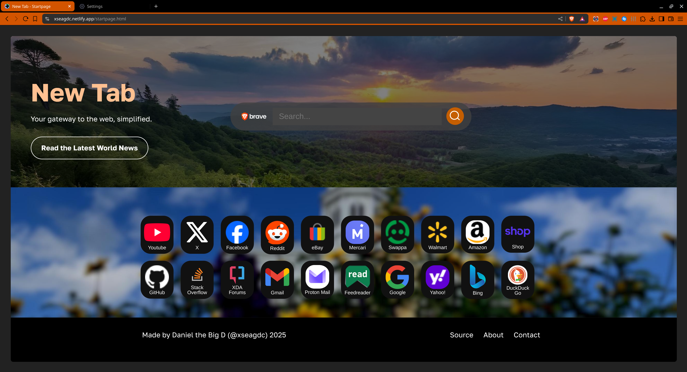

# [Startpage](https://xseadgdc.github.io/BrowserStartpage/startpage.html) - A Simple and Clean New Tab Interface for your Browser
Even yet another homepage for your browser! Its sleek, elegant, and unique design limits distraction while being eye-candy (at least to certain men like me that like orange on black). Feel free to clone/fork this repo and modify it to your needs!
## Screenshot

## How to Edit
 1. Hold down Shift+Ctrl+I or right-click your mouse on an element you want to change. 
 2. If the element is not selected, click the very top far-left icon in the Developer Tools panel with an arrow pointing to a dotted square. Now, click on the element you want to change again.
 3. Change the values as you wish in the HTML Source.
 4. To save your changes, right-click on the page, click "Save As..." select the file's location, and click the Save button. A dialog will then appear; click the appropriate button to replace it.
 5. Reload the page to check if your changes have taken effect.
## Liscenses 
Portions of this repo are under the MIT license, while everything else is licensed under GPL 3.0.
